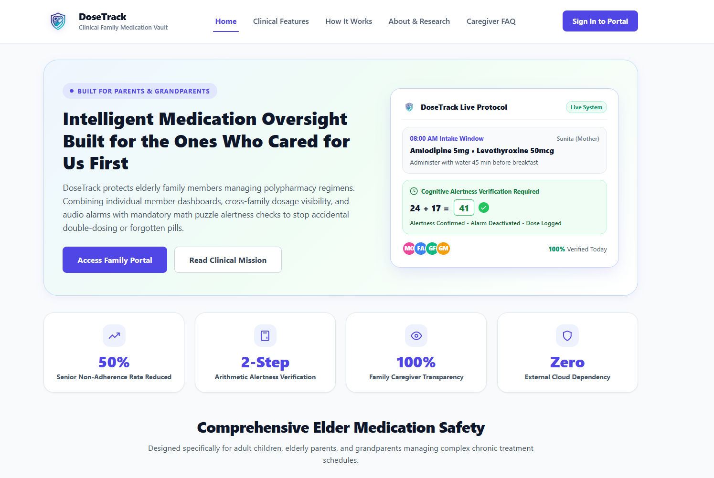
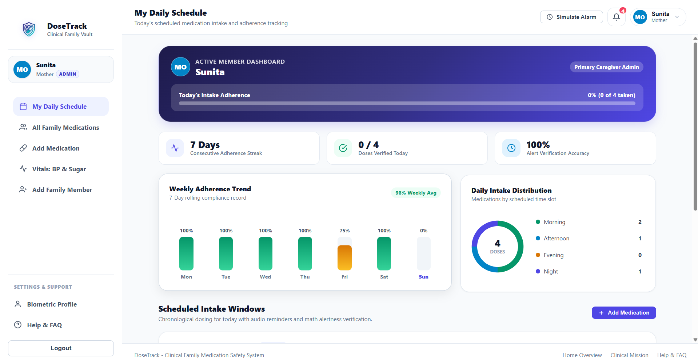
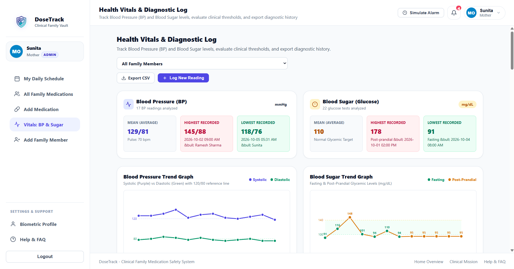

# DoseTrack

## Description

DoseTrack is a simple medication tracker made for families, especially for parents and grandparents. When loved ones take multiple pills each day, it is easy to forget whether a morning pill was already taken, or accidentally take the same tablet twice. 

DoseTrack gives families peace of mind. It allows family members to see each other's daily schedules, rings gentle audio alarms when it is time to take pills, and asks simple math questions to make sure the person is fully awake before turning off the alarm. All health records stay safe and private on your own system without being shared with outside companies.

<div align="center">

</div>

---

## Key Features

- **Family Medication Schedules:** See daily medicines for yourself and your family members on a single screen.
- **Wake-Up Math Alarms:** When a pill alarm sounds, you solve two simple math questions (such as 12 + 8) to turn it off. This helps prevent turning off an alarm while half-asleep.
- **Track Blood Pressure and Blood Sugar:** Easily record daily blood pressure and sugar numbers. View simple charts showing your highest, lowest, and average readings, and download a CSV file to share with your doctor.
- **Simple Sign In:** Log in with just a username and password. No complex PIN numbers or tricky keypad codes. Easy one-click demo buttons let you try the app right away.
- **Family Admin Support:** One family member can act as the main admin to help add medicines, update schedules, or help elderly relatives who forget passwords.
- **Private and Safe:** Your health details stay on your own computer and are never sent to outside advertising or data-tracking companies.


---

## Why Does Open Innovation Matter?

Open innovation is essential when building technology for family health and elder care:

1. **Medical Privacy and Data Sovereignty:**
   Commercial elder-care applications routinely monetize patient data, transmitting prescription lists, diagnoses, and daily adherence patterns to data brokers and behavioral advertising networks. By building on open-source standards with local vault storage, DoseTrack ensures that a family's clinical records never leave their own infrastructure.

2. **Uninterrupted Longevity:**
   Closed proprietary health platforms regularly change pricing models, deprecate essential APIs, or shut down entirely when venture funding runs dry. An open-source application ensures that a family's care protocol remains functional indefinitely, free from vendor lock-in.

3. **Deterministic Reliability Over Black-Box Hallucinations:**
   When dealing with critical dosages and medication schedules, probabilistic black-box cloud APIs cannot be trusted with unsupervised medical decisions. Open-source architecture enabled us to pair intelligent agent design with deterministic, auditable rules for alarm timing, arithmetic challenge validation, and biometric aggregation.

<div align="center">

</div>

<div align="center">

</div>


---

## Technology Stack
- **Backend Framework:** Python 3 with FastAPI and Uvicorn for asynchronous REST endpoints.
- **Architecture:** Local-first JSON/CSV clinical vault with automated data validation and migration.
- **Frontend:** Semantic HTML5, CSS3 with custom CSS variable theming, and modular Vanilla JavaScript without heavy frontend framework bloat.
- **Audio Synthesis:** Native browser Web Audio API oscillator synthesis for reliable chime alarms without external audio downloads or network latency.
- **Visualization:** Interactive Canvas-based trend charts with hover inspection and dynamic range calculations.
- **Deployment:** Render-native web service with pre-configured render.yaml, Procfile, and zero-dependency build pipeline.

---

## Quick Start & Installation

Follow these simple steps to run DoseTrack on your computer:

### Step 1: Install Python
Make sure you have Python (version 3.10 or newer) installed on your computer. You can check by opening your terminal or command prompt and typing:
```bash
python --version
```

### Step 2: Download the Project
Download the project files or clone the repository using Git:
```bash
git clone https://github.com/your-username/dosetrack.git
cd dosetrack
```

### Step 3: Install Required Packages
Install the required tools by running:
```bash
pip install -r requirements.txt
```

### Step 4: Run the Application
Start the application with this command:
```bash
python main.py
```
Or:
```bash
python -m uvicorn main:app --reload
```

### Step 5: Open in Your Browser
Open your web browser and go to:
```
http://localhost:8000
```
Click any of the demo login buttons (such as Sunita or Rajesh) to start exploring immediately.

---

## Folder Structure

```text
dosetrack/
├── main.py                      # Starts the web application server
├── requirements.txt             # List of required Python packages
├── Procfile                     # Deployment file for cloud hosting
├── render.yaml                  # Configuration file for Render deployment
├── core/                        # Handles family profiles and medication data
│   ├── models.py                # Local JSON vault, biometrics, credentials, and adherence logic
│   ├── ai_engine.py             # Local clinical entity extractor and Q&A engine
│   └── sample_data.py           # Pre-configured clinical prescriptions and pharmacy records
├── data/                        # Stores saved blood pressure and sugar records
│   ├── vitals_records.csv       # CSV database for blood pressure and sugar readings
│   └── medication_adherence_sample.csv # Adherence logs
├── static/
│   ├── css/
│   │   └── styles.css           # Colors, layout, responsive theming, and 100vh sidebar
│   ├── images/
│   │   └── logo.png             # DoseTrack shield and pill emblem
│   └── js/                      # App interactions, alarms, and math puzzles
│       ├── api.js               # Asynchronous HTTP client layer
│       ├── alarm.js             # Web Audio chime synthesis and 2-puzzle math challenge system
│       ├── home.js              # Public homepage controller and collapsible FAQs
│       ├── about.js             # About page controller and collapsible FAQs
│       ├── login.js             # PIN-free username/pwd authentication and registration
│       └── dashboard/           # Modular dashboard JavaScript controllers
│           ├── dashboard.js     # Master dashboard coordinator & popovers
│           ├── schedule.js      # Daily schedule rendering & verification
│           ├── family.js        # All family medications roster
│           ├── add_medication.js# Add medication form handler
│           ├── vitals.js        # BP & Sugar logging, stats, and CSV export
│           ├── add_member.js    # Add connected family member controller
│           ├── profile.js       # Biometric profile controller
│           └── help.js          # In-dashboard Help & FAQ accordion
├── templates/                   # Web pages (Home, About, Login, and Dashboard)
│   ├── index.html               # Public homepage with interactive hero & FAQ
│   ├── about.html               # Dedicated about page with clinical mission
│   ├── login.html               # Login/register page with quick demo buttons
│   ├── dashboard.html           # Authenticated dashboard fallback template
│   └── dashboard/               # Modular dashboard page components
│       ├── index.html           # Master dashboard layout with stationary sidebar
│       ├── schedule.html        # Daily schedule component
│       ├── family.html          # All family medications roster component
│       ├── add_medication.html  # Add medication form component
│       ├── vitals.html          # Vitals logging and graphs component
│       ├── add_member.html      # Add family member component
│       ├── profile.html         # Biometric profile component
│       └── help.html            # In-dashboard Help & FAQ component
├── family_health_vault.json     # Local JSON data store for family profiles
└── README.md                    # Project documentation
```

---

## Future Work

- **SMS and WhatsApp Alerts:** Send a gentle text message to family caregivers if an elderly relative misses a dose by more than 30 minutes.
- **Pill Bottle Photo Scanner:** Allow users to snap a photo of a medicine label to automatically add the pill name and directions.
- **Doctor Visit Notes:** A simple section to write down notes and questions for upcoming clinic visits next to blood pressure history.
- **Spoken Voice Reminders:** Friendly voice prompts that speak the medicine name aloud for seniors with low vision.
